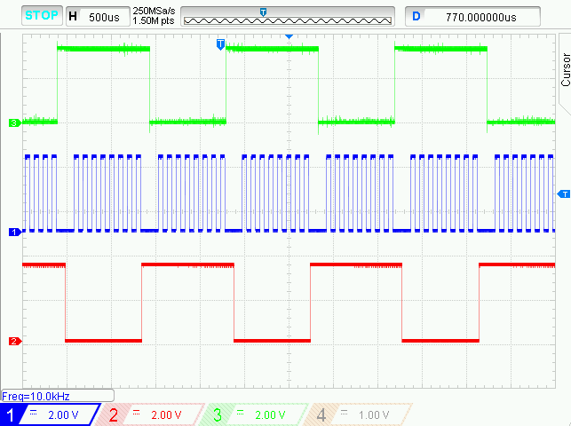

# PIC18F47Q10 Using TMR2 as Alternate SPI clock

The PIC18F47Q10 features Three 8-bit Timers/Counters and two MSSP modules, which can be configured in SPI mode.
In this demo, the TMR2 is used as 10kHz clock for SPI, configured as master with 2 slaves (RC6 pin ->SS1 and RC7 pin ->SS2).

## Related Documentation
- Technical Brief Link [(linkTBD)](http://www.microchip.com/)
- [PIC18F47Q10 Product Family Page](https://www.microchip.com/design-centers/8-bit/pic-mcus/device-selection/PIC18F47Q10)
- [PIC18F47Q10 datasheet](http://ww1.microchip.com/downloads/en/DeviceDoc/40002043D.pdf) for more information or specifications.

## Software Used

- MPLAB® X IDE 5.30 or newer [(microchip.com/mplab/mplab-x-ide)](http://www.microchip.com/mplab/mplab-x-ide)
- MPLAB® XC8 2.10 or newer compiler [(microchip.com/mplab/compilers)](http://www.microchip.com/mplab/compilers)
- MPLAB® Code Configurator (MCC) 3.95.0 or newer [(microchip.com/mplab/mplab-code-configurator)](https://www.microchip.com/mplab/mplab-code-configurator)
- MPLAB® Code Configurator (MCC) PIC10/PIC12/PIC16/PIC18 library v1.79.0 or newer [(microchip.com/mplab/mplab-code-configurator)](https://www.microchip.com/mplab/mplab-code-configurator)

## Hardware Used
- PIC18F47Q10 Curiosity Nano [(DM182029)](https://www.microchip.com/Developmenttools/ProductDetails/DM182029)
- An oscilloscope or logic analyzer

## Setup

The PIC18F47Q10 Curiosity Nano Development Board [(DM182029)](https://www.microchip.com/Developmenttools/ProductDetails/DM182029) is used as the test platform.
     

The following pin configurations must be made for this project:

|Pin           | Configuration     |
| :----------: | :---------------: |
|RC3           | Digital output SCK  |
|RC4           | Digital input SDI  |
|RC5           | Digital output SDO  |
|RC6           | Digital output SS1  |
|RC7           | Digital output SS2  |

## Operation
1. Calculate the SCK frequency using the formula `frequency = 1/Timer2Period/2`.
2. For example for 10kHz `frequency = 1/50μS/2 = 10 kHz`, this means `Timer2Period = 50μS`.
3. Build demo firmware, make and program the generated code onto the PIC18F47Q10 Curiosity Nano.
4. Run the code, connect an oscilloscope or logic analyzer to the pins:
- RC3 pin - SCK -> Channel 1 (blue)
- RC6 pin - SS1 -> Channel 2 (red)
- RC7 pin - SS2 -> Channel 3 (green)
5. In the screenshot below, the SCK frequency is 10 kHZ (blue signal).
     

## Summary

This project showcases how easy it is to use the TMR2 of PIC18F47Q10 as Alternate SPI clock.
