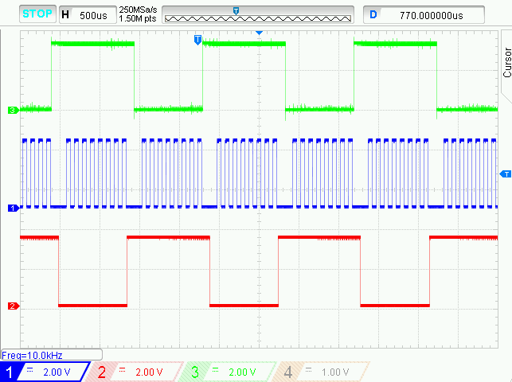

 <article class="markdown-body entry-content p-3 p-md-6" itemprop="text">

# PIC18F47Q10 Using TMR2 as Alternate SPI clock

## Objective:
The PIC18F47Q10 features Timers and two MSSP modules, which can be configured in SPI mode.
In this demo, the TMR2 is used as 10kHz clock for SPI, configured as master with 2 slaves (RC6 pin ->SS1 and RC7 pin ->SS2).

## Resources:
- Technical Brief Link [(linkTBD)](http://www.microchip.com/)
- MPLAB® X IDE 5.30 or newer [(microchip.com/mplab/mplab-x-ide)](http://www.microchip.com/mplab/mplab-x-ide)
- MPLAB® XC8 2.10 or newer compiler [(microchip.com/mplab/compilers)](http://www.microchip.com/mplab/compilers)
- MPLAB® Code Configurator (MCC) 3.95.0 or newer [(microchip.com/mplab/mplab-code-configurator)](https://www.microchip.com/mplab/mplab-code-configurator)
- PIC18F47Q10 Curiosity Nano [(DM182029)](https://www.microchip.com/Developmenttools/ProductDetails/DM182029)
- Curiosity Nano Base for Click Boards™ [(AC164162)](https://www.microchip.com/Developmenttools/ProductDetails/AC164162)
- POT click board™ [(MIKROE-3402)](https://www.mikroe.com/pot-click)
- [PIC18F47Q10 datasheet](http://ww1.microchip.com/downloads/en/DeviceDoc/40002043D.pdf) for more information or specifications.

## Hardware Configuration:
The PIC18F47Q10 Curiosity Nano Development Board [(DM182029)](https://www.microchip.com/Developmenttools/ProductDetails/DM182029) is used as the test platform.
The following configurations must be made for this project:
- RC3 pin - SCK
- RC4 pin - SDI
- RC5 pin - SDO
- RC6 pin - SS1
- RC7 pin - SS2

## Demo:
Run the code generated by MCC, connect an oscilloscope or logic analyzer to the pins and see the results.
In the screenshot below, we can see the SCK frequency is 10 kHZ , this is done using the formula `frequency = 1/Timer2Period/2`
we have set `Timer2Period = 50μS` then `frequency = 1/50μS/2 = 10 kHz`
- RC3 pin - SCK -> Channel 1 (blue)
- RC6 pin - SS1 -> Channel 2 (red)
- RC7 pin - SS2 -> Channel 3 (green)

